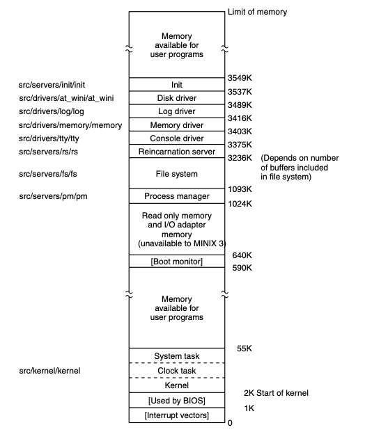
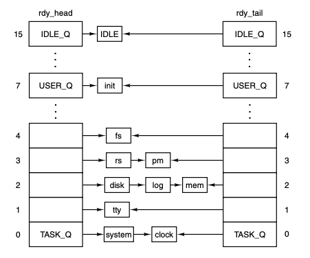

# 2.6 - Implementação Processos MINIX 3


## 2.6.1 - Organização do código do MINIX

* Localização do código em C para plataforma Intel: `/usr/src/`
* `/usr/src/include`: header dos arquivos em C
* Cada diretório na árvore do diretório fonte (`src/`) possui um **Makefile**
* `make`: compilação eficiente de programas com vários arquivos fonte
  * Garante que todos arquivos necessários são compilados
  * Recompila apenas arquivos modificados
  * Direciona a combinação de módulos separados em um programa executável
* Árvore `src/` pode ser realocada pois o Makefile usa paths relativos aos respectivos diretórios fontes
  * Diretório fonte na raiz `/src/` para compilação mais rápida se o dispositivo na raiz é um RAM disk

### Path para os headers

* Makefile espera encontrar headers em `/usr/include/`
* Porém o Makefile para recompilar o sistema `src/tools/Makefile` espera uma cópia dos headers em `/usr/src/include/`
  * Antes de recompilar, `/usr/include/` é deletado e `/usr/src/include/` é copiado para ele
* `#include <filename>`: procura por padrão em `/usr/include/`
* `#include "filename"`: procura primeiro no mesmo diretório que o arquivo fonte (ou subdiretório especificado). Se não encontrar procura no diretório padrão

### Diretório `/usr/src/include/`

* Contém headers padrão do POSIX
* Três subdiretórios adicionais
  * `sys/`: headers adicionais do POSIX
  * `minix/`: headers usados pelo MINIX 3
  * `ibm/`: headers com definições para IBM-PC
* Outros arquivos e subdiretórios podem ser inclusos aqui para funcionalidades extras
  * Extensões de rede: `/usr/src/include/arpa/`, `/usr/src/include/net`, `/usr/src/include/net/gen`

### Subdiretórios adicionais em `/usr/src/`

* Três subdiretórios do SO
  * `kernel/`: camada 1 (escalonamento, mensagens, clock e system tasks)
  * `drivers/`: camada 2 (drivers de dispositivos)
  * `servers/`: camada 3 (gerenciador de processos, sistema de arquivos, etc)
    * Também programa `init` e servidor de reencarnação `rs`
    * `/usr/src/servers/inet/`: servidor de rede
* Diretórios de código fonte adicionais
  * `/usr/src/lib/`: procedimentos de biblioteca
  * `/usr/src/tools/`: makefile e script para construção do MINIX
  * `/usr/src/boot/`: boot e instalação do MINIX
* `/usr/src/test/`: programas para testar um MINIX 3 recém compilado
* `/usr/src/commands`: programas utilitários (`cat`, `cp`, `date`, `ls`, `pwd`, mais 200 outros)

### Padrão de nomes de arquivos

* No livro refere-se a nomes simples quando se depreende do contexto o path completo
  * `const.h` está presente em vários lugares, como `/usr/src/kernel/` e `/usr/src/servers/pm/`

### Camada 01

* System task: interface entre serviços do kernel e processos em camadas superiores
* Clock task: sinais de tempo para o kernel

## 2.6.2 - Compilando e executando MINIX

* **Compilar**: executar make e `/usr/src/tools/`

  * Sem argumentos: lista argumentos
  * `make image`: headers em `/usr/src/include/` são copiados para `/usr/include/`
    * Códigos em `/usr/src/kernel/`, `/usr/src/drivers/*` e `/usr/src/servers/*` são compilados em código objeto
    * Código objeto do kernel é linkado para formar o executável `kernel`
      * O mesmo em `/usr/src/servers/pm` para `pm` e `/usr/src/servers/fs` para `fs`
    * Programas da imagem de boot são compilados e linkados em seus diretórios (`rs`, `init`, etc)

* Para instalar o sistema capaz de ser bootado, `installboot` (código em `/usr/src/boot/`) adiciona nomes aos componentes da imagem de boot, separando-os tal que seu comprimento seja múltiplo do tamanho do setor do disco (facilita carregar partes independentemente), e concatenando em um único arquivo (a imagem de boot, que pode ser copiada para o diretório `/boot/` ou `/boot/image/` de um disquete ou partição)

* **Memória após carregamento da imagem de boot**: 

  * 

  * O kernel é carregado em valores baixos de memória
  * Se um programa de usuário cabe na memória disponível logo acima do Kernel, será usado aí, senão será carregado acima do `init`

* MINIX 3 consiste de programas independentes que se comunicam apenas por passagem de mensagem

  * Únicos procedimentos que os 3 componentes do SO têm em comum são as rotinas de biblioteca em `/usr/src/lib/`

## 2.6.3 - Arquivos de header comuns

* `/usr/src/include/`: contém arquivos definindo constantes, macros e tipos
* Padrão POSIX define em quais arquivos cada definição necessária deve estar
* `/usr/src/include/sys/`: arquivos usados para compilar programas e utilitários do sistema

### Header de próposito geral

* Não referenciados diretamente por qualquer dos arquivos fonte em C, incluídos em outros headers

* **Header mestre**: para cada componente principal do MINIX

  * `usr/src/kernel/kernel.h`, `usr/src/servers/pm/pm.h`, `usr/src/servers/fs/fs.h` e `usr/src/drivers/drivers.h`

  * **Exemplo de header mestre**

    * ```c
      #include <minix/config.h> /* PRECISA ser o primeiro */
      #include <ansi.h> /* PRECISA ser o segundo */
      #include <limits.h>
      #include <errno.h>
      #include <sys/types.h>
      #include <minix/const.h>
      #include <minix/type.h>
      #include <minix/syslib.h>
      #include "const.h"
      ```

      * Headers de vários diretórios usados juntos
      * `const.h` de dois locais diferentes são usados

### `ansi.h`

* Linha 0000
* Segundo header processado quando qualquer parte é compilada
* Testa se o compilador cumpre os requisitos do Padrão de C
* **Macro de teste de recurso**: `ansi.h` define vários macros de formas diferentes dependendo se o macro `_ANSI` está definido
  * Outro exemplo é `_POSIX_SOURCE` (linha 0065)
* Em C, os tipos de dados dos argumentos e valores retornados precisam ser conhecidos antes que tal dados sejam gerados
  * C permite **protótipos de funções** para **declarar** os tipos dos argumentos e valores de retorno de uma função antes que ela seja **definida**
  * Macro `_PROTOTYPE`
    * Para compilador ANSI escrever na forma:
      * `_PROTOTYPE (return-type function-name, (argument-type argument, ...))`
      * E transformar em:
        * `return-type function-name(argument-type, argument, ...)`
    * Compilador mais antigo é transformado em:
      * `return-type function-name()`
* **ifndef**: `#ifndef _ANSI_H` e `#endif` (ou `#endif /* _ANSI_H */`)
  * `_ANSI_H` é definido na linha logo após o `ifndef`
  * Um header só deve ser incluído uma vez na compilação
  * Um underscore precede o nome do arquivo, porém outro header pode existir nos diretórios de código fonte C, usado sem o underscore, não prevenindo o processamento de outro header com o mesmo nome
  * O comentário após o `endif` é opcional, mas ajuda a identificar seções aninhadas

### `limits.h`

* Linha 0100
  * Apêndice B começa a contar o código do arquivo seguinte a partir do múltiplo de 100 seguinte
* Define tamanhos básicos, como tamanho de tipos na linguagem (bits de um inteiro) ou do SO (quantidade de caracteres no nome de arquivo)

###```errno.h```

* Número de erros retornados aos programs de usuário na variável global `errno` quando uma chamada de sistema falha
* Examinar a variável global seria ineficiente, portanto MINIX retorna o número dos erros como valores negativos para marcar o valor de retorno como código de erro dentro do sistema e depois converter para positivo antes de retornar para programs de usuário
  * Truque para isso em `#define EPERM (_SIGN 1)` (**linha 0236**)
    * O header mestre define o macro `_SYSTEM` em cada parte do SO e o mesmo não ocorre na compilação de um programa de usuário

### Headers não usados em todos headers mestres

* `unistd.h`: **linha 0400**
  * Define várias constantes (maioria necessária por POSIX)
  * Protótipos de funções C, incluindo para acessar chamadas de sistemas
  * **Definição de NULL**: `#define NULL ((void *)0)`
    * POSIX
* `string.h`: **linha 0600**
  * Protótipos de funções para manipular strings
* `signal.h`: **linha 0700**
  * Nomes padrões de sinais
  * Protótipos de funções relacionadas a sinais

## 2.6.10 - Escalonamento MINIX 3

* Algoritmo de escalonamento multinível
* Prioridades iniciais aos processos que podem ser trocadas durante execução
  * Maior prioridade da camada 01 à 04
  * Dentro de cada camada as prioridades podem ser diferentes
  * Todos processos de usuário inicialmente iguais, comando `nice` pode aumentar ou diminuir

### Fila de processos na inicialização

* No momento do término da inicialização e começo da execução (linha 7252 em `kernel/main.c`)
* Array `rdy_head`: uma entrada por fila apontando para o processo encabeçando ela
* Array `rdy_tail`: uma entrada por fila apontando para o último processo de cada fila
* Arrays definidos com o macro `EXTERN` (`kernel/proc.h`: 5595 e 5596)
  * `EXTERN` é macro para `extern`: evita que variáveis declaradas em `.h` sejam armazenadas várias vezes (uma vez para cada ver que o arquivo for linkado)
* A fila inicial é definida durante a inicialização pela tabela `image` em `table.c` (6095 a 6109)
  * Tabela que lista todos programas que pertencem à imagem de boot
* 16 filas, uma por nível de prioridade
  * 

* Escalonamento por rodízio: após consumir o quantum, o processo vai para o fim da fila e recebe novo quantum
* Quando um processo bloqueado acorda ele é colocado na cabeça da fila se tinha quantum restante
* Processos bloqueados são removidos da fila, onde ficam só os processos executáveis
* Algoritmo: encontrar a fila de maior prioridade (sendo a maior, zero) não vazia e escolher o processo na cabeça
* Processo `IDLE` sempre pronto e na fila de menor prioridade, se todas outras estão vazias, ele executa

### Funções

* `enqueue`: chamada com um ponteiro para uma tabela de processo como argumento (linha 7787)
  * Chama `sched` para determinar em qual fila o processo deve ser colocado e se na cabeça ou cauda da fila
  * Insere de acordo com uma lista ligada com cabeça e cauda
  * `pick_proc` é camada para determinar o próximo processo a executar
* `dequeue`: chamada com um ponteiro para tabela de processo como argumento (linha 7823)
  * Processo precisa estar rodando para bloquear
    * Provavelmente na cabeça da fila
  * Se um sinal foi enviado para matar processo que não executava, a fila deve ser percorrida para encontrá-lo
    * Ajustar todos ponteiros de acordo
  * Se o processo estava em execução, chamar `pick_proc` para executar um novo
  * No começo, testar se o processo removido opera no espaço do kernel (checando a integridade das áreas de pilha compartilhadas entre tarefas que rodam no kernel, pois compartilham a mesma área de pilha definida por hardware)
    * Em caso positivo checar se o padrão no final da área da pilha do processo não foi sobreescrito (7835 a 7838)
* `sched`: seleciona em qual fila colocar um processo e se colocar no começo ou final
  * Tabela de processos: quantum, tempo restante de quantum, prioridade e prioridade máxima
  * De 7880 a 7885 checa se o quantum foi usado inteiramente
    * Caso não, reinicia com o que faltava
    * Se foi usado checa se rodou duas vezes seguidas
      * Caso sim, recebe penalidade de `+1` na prioridade para evitar loop infinito
      * Se outro processo rodou, penalidade `-1`
  * Dois processo alternando em loop juntos é um problema em aberto
  * Todos processos começam com sua prioridade máxima, portanto penalidades negativas não alteram em nada até se tornarem positivas
  * Limite inferior é que processos nunca podem ser colocados na fila de `IDLE`
* `pick_proc` (linha 7910): configura `next_ptr`
  * Sempre que um processo bloqueia, `pick_proc` é chamado para reescalonar a CPU
  * Testa cada fila. Se um processo na primeira fila está pronto configura `proc_ptr` e já retorna, senão vai checando cada fila até `IDLE_Q`
  * Ponteiro `bill_ptr` é alterado para rastrear o tempo de CPU dado a um processo na linha 7694

### Procedimentos restantes em `proc.c`

* `lock_send`, `lock_enqueue` e `lock_dequeue`
  * Dão acesso às funções básicas usando `lock` e `unlock` da mesma maneira que `lock_notify`

### Resumo

* Múltiplas filas de prioridade
* Primeiro processo na fila de maior prioridade sempre roda a seguir
* Clock task monitra o tempo usado pelos processos
* Se usa todo o quantum é colocado no final de sua fila
* Task, drivers e servidores são esperados a rodar até bloquear, recebendo um grande quantum, mas se demorarem pode ser preemptados
  * Previne que processos de alta prioridade travem o sistema
  * Um processo que previne outros de serem rodados podem ser movidos para uma fila de menor prioridade temporariamente

## 2.6.11 - Suporte de Kernel dependente do hardware

