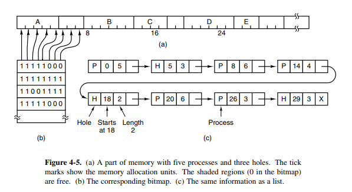

# 4.2 - Swapping

* Dois approaches para gerenciamento de memória
  * **Swapping**: trazer todo o processo do disco, rodar por algum tempo e colocá-lo de volta no disco
  * **Memória virtual**: programas podem executar mesmo estando parcialmente na memória principal
* Memória com variação de partições dinâmicas flexibilizam a utilização de memória mas complicam a alocação e desalocação de memória e manutenção
* **Compactação de memória**: combinar todos os buracos de memória em um só, movendo todos processos para baixo
  * Requer muito tempo de CPU (da ordem de 0.5s)
* O segmento de dados do processo pode crescer (alocação dinâmica de memória do heap)
  * Crescimento para dentro de um buraco adjacente, senão deve ser movido para um buraco maior na memória ou fazer swap em processos para criar tal buraco
  * Se não pode crescer na memória e a área de swap está cheia, o processo deve aguardar ou ser morto
* Se é esperado que o processo cresça enquanto executa, é bom alocar memória extra para reduzir o overhead (sobrecarga) de mover ou fazer swap de processos
  * Porém ao fazer swap, é um desperdício fazer da memória extra também
  * **Disposição**: espaço para crescimento ENTRE a stack de um processo e seus segmentos de dados
    * A stack cresce para baixo (variávies normais e endereços de retorn) e o segmento de dados cresce para cima (heap para variáveis alocadas dinamicamente)
    * Se a memória entre os segmentos acabar, o processo deve ser movido para um nov buraco com espaço suficiente, sofrer swap ou ser morto

## 4.2.1 - Gerenciamento de memória com Bitmap

* Gerenciamento de memória dinâmica: bitmap ou free lists (listas de regiões livres)
* **Bitmap**: memória dividida em unidades de alocação
  * Problema de design: tamanho da unidade de alocação
    * Unidade de 4 bytes: `32 * n` bits usam um `n` bits no mapa, bitmap ocupa `1/33` da memória
    * Com uma unidade maior, o bitmap é menor mas gasta-se mais espaço
* Ao tentar trazer um processo que ocupa `k` unidades para a memória, precisa-se procurar o bitmap por `k` zeros consecutivos (operação lenta)

### Esquematização de um bitmap e lista ligada de gerenciamento de memória

* 

## 4.2.2 - Gerenciamento de memória com lista ligada

* Lista ligada com os segmentos livres e os alocados na memória
* Composição de cada entrada:

  * Buraco (H) ou processo (P)
  * Endereço de início
  * Comprimento do segmento
  * Ponteiro para a próxima entrada na lista
* Ordenar a lista por endereço facilita atualizar ela

  * Quatro combinações quando um processo X termina:

    * `| A | X | B |` vira `| A |   | B |`

      * Trocar P por H

    * `| A | X |   |` vira `| A |   |   |`

      * Duas entradas viram uma, diminuindo a lista

    * `|   | X | B |` vira `|   |   | B |`

      * Duas entradas viram uma, diminuindo a lista

    * `|   | X |   |` vira `|   |   |   |`

      * Três entradas viram uma, dois itens são removidos da lista
* É mais conveniente que a lista seja duplamente ligada para acessar a entrada anterior com maior facilidade

### Algoritmos para alocar memória

* Em lista ordenada por endereço
* Assumir que o gerenciador de memória sabe quanta memória alocar
* **First fit**: "primeiro que couber"
  * Gerenciador de processos (**PM**) procura pela lista até encontrar um buraco em que o novo procesos caiba
  * Se não for o tamanho exato de memória, o buraco é quebrado em um pedaço para o processo e outro para a memória que não foi usada
* **Next fit**: "próximo que couber"
  * Armazena o local de um buraco adequado pois da próxima vez chamado não começará do início como no **first fit**
  * Bays (1977) mostrou que **next fit** tem performance ligeiramente pior que **first fit**
* **Best fit**: "o que melhor couber"
  * Procura a lista toda e pega o menor buraco que couber o processo
  * Mais devagar pois percorre toda a lista
  * Gasta mais memória que o **first fit**/**next fit** pois a tendência é deixar a memória cheia de buracos pequenos inutilizáveis
* **Worst fit**: "o que pior couber"
  * A ideia é que o buraco deixado seja o maior possível para ainda ser útil
  * Porém, simulando mostra-se que também não é ideal

### Otimizações dos algoritmos

1. Listas separadas para processos e buracos
   * Facilita inspecionar apenas buracos
   * Complexidade e demora adicional para desalocar memória: segmento livre precisa ser removida da lista de processos e colocado na lista de buracos
2. Manter a lista de buracos ordenada por tamanho
   * Menor para maior
   * **First fit** e **best fit** são redundantes
3. Usar os próprios buracos na memória ao invés de uma lista externa
   * Primeira palavra do buraco: tamanho dele
   * Segunda palavra: ponteiro para o buraco seguinte

### Algoritmo quick-fit

* Tabela com entradas para várias listas, onde cada lista agrega buracos de mesmo tamanho
* Exemplo: primeira lista com buracos de 4KB, segunda entrada com 8 KB, terceira com 12 KB, etc
* **Vantagem**: rápido para encontrar um buraco do tamanho necessário
* **Desvantagem**: encontrar os vizinhos de um processo a ser removido para juntar eventuais buracos é ineficiente
  * Sem juntar os buracos a memória rapidamente fragmenta em pequenos buracos onde nenhum processo cabe